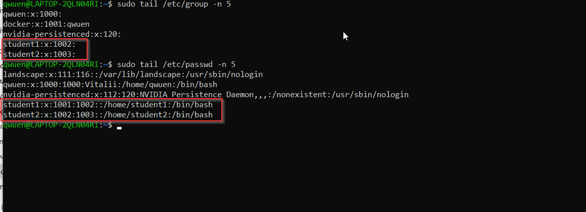
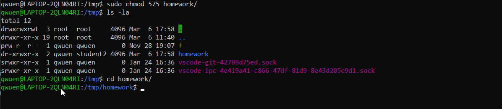

### Задание 1

- Создайте пользователя `student1` с оболочкой bash, входящего в группу `student1`.
- Создайте пользователя `student2`, входящего в группу `student2`.

  

### Задание 2

- Создайте в общем каталоге, например, /tmp, директорию.
- Назначьте для неё полный доступ со стороны группы `student2` и доступ на чтение всем остальным.  

```
sudo chgrp student2 homework  
sudo chmod g+rwx homework  
sudo chmod +r homework
```

  

### Задание 3

- Определите, какой режим доступа установлен для файлов `/etc/passwd` и `/etc/shadow`.
- Объясните, зачем понадобилось именно два файла.  

`/etc/passwd` - файл для хранения информации о пользователях, доступен для чтения всем  

`/etc/shadow` - файл содержит информацию о паролях пользователей доступен для чтения только `root`.  
Строка файла содержит поля разделённые двоеточиями, в полях находится следующая информация:
- имя пользователя;
- хеш пароля;
- дата последней смены пароля в днях начиная с 1 января 1970 года, чем больше число, тем новее пароль;
- минимальный срок действия пароля, если 0 то неограничен;
- максимальный срок действия пароля;
- период предупреждения о необходимости сменить пароль;
- период неактивности пароля — у меня пустое поле, период неактивности отсутствует;
- дата истечения срока действия учётной записи — у меня пустое поле, учётная запись никогда не устаревает;
- зарезервированное поле для использования в будущем. 

### Задание 4*

Изучите информацию о SELinux из открытых источников.

Ответьте на вопросы:

- Что из того, что предлагает SELinux, может быть реализовано в стандартном Linux?
По идее это разные подходы к организации безопасности и эти механизмы работают параллельно.  
- Можно ли установить SELinux поверх существующей ОС Linux?  
 SELinux может работать параллельно с классической избирательной системой контроля доступа и действует после классической модели безопасности Linux. Иными словами, через SELinux нельзя разрешить то, что запрещено через права доступа пользователей или групп.