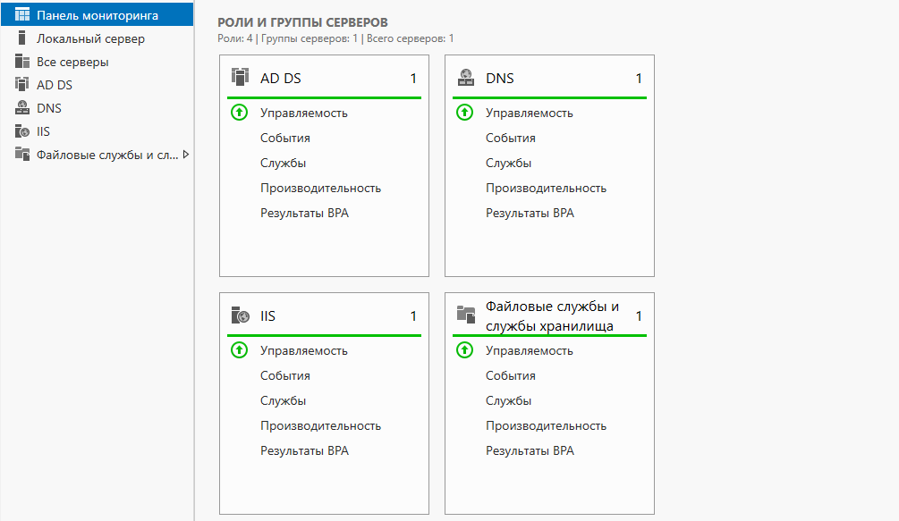
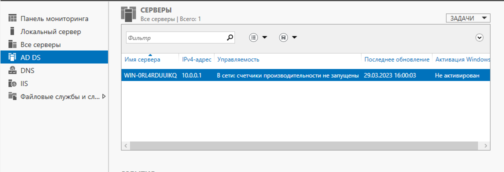
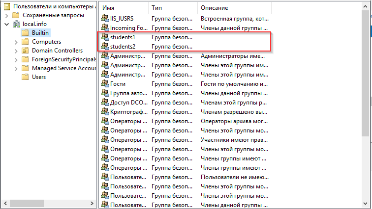
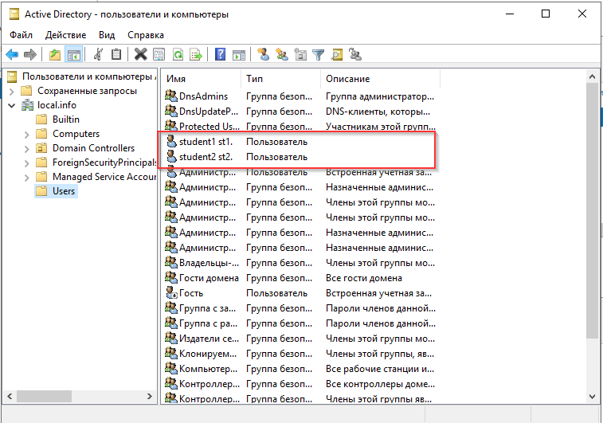
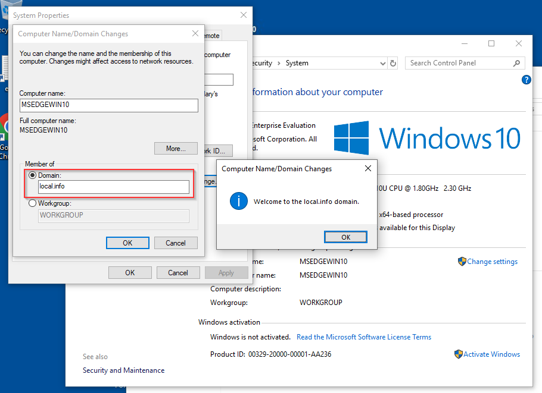
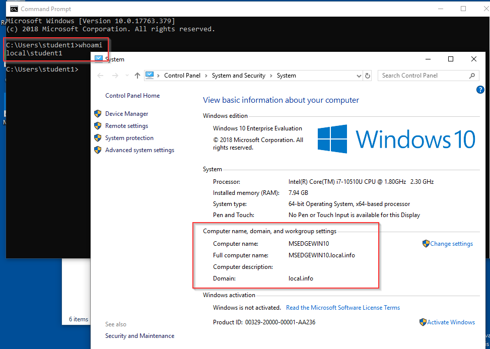
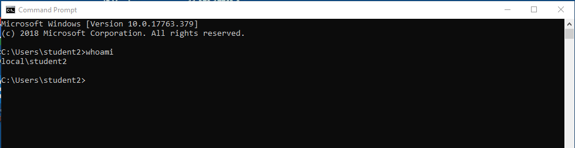

# Домашнее задание к занятию «Active Directory. Часть 1»

### Задание 1

1. Скачайте и установите Windows Server 2019 (2016), используя файл по [ссылке](https://www.microsoft.com/en-us/evalcenter/evaluate-windows-server-2019). 

Настройки виртуальной машины:
- два сетевых интерфейса: NAT и внутренняя сеть;
- оперативная память — 2–4 Гб.

2. Настройте Active Directory, используя материалы из открытых источников ниже:

 

 

------

### Задание 2

Создайте в AD:

- пользователя `student1`, входящего в группу `students1`;
- пользователя `student2`, входящего в группу `students2`.

  

 

------

### Задание 3

- Создайте или используйте существующую ВМ с установленной ОС Windows и подключите к домену
- Зайдите под доменными учётными записями.

 

 

 
------