# Домашнее задание к занятию «Penetration Testing. Часть 2»

## Результаты тестирования
- Отсутствие проверки авторизации в запросах, требующих административных привилегий ([A01:2021-Broken Access Control](https://owasp.org/Top10/A01_2021-Broken_Access_Control/))  
**Критичность:** <font color="red">**Высокая**</font>  

- Наличие [SQL Injection](https://owasp.org/www-community/attacks/SQL_Injection) уязвимости на странице ([A03:2021-Injection](https://owasp.org/Top10/A03_2021-Injection/))  
**Критичность:** <font color="red">**Высокая**</font>  

- Использование стандартных УЗ при подключении к БД ([A05:2021-Security Misconfiguration](https://owasp.org/Top10/A05_2021-Security_Misconfiguration/))  
**Критичность:** <font color="red">**Высокая**</font>  

- Отсутствие инвалидации сессии пользователя по времени бездействия. Нет привязки сессии к устройству(браузеру)  
**Критичность:** <font color="orange">**Средняя**</font>  

- Использование слабых алгоритмов хеширования паролей ([A02:2021-Cryptographic Failures](https://owasp.org/Top10/A02_2021-Cryptographic_Failures/))   
**Критичность:** <font color="orange">**Средняя**</font>  

- Наличие хранимой XSS уязвимости ([A03:2021-Injection](https://owasp.org/Top10/A03_2021-Injection/), [Stored XSS](https://owasp.org/www-community/attacks/xss/#stored-xss-attacks))  
**Критичность:** <font color="orange">**Средняя**</font>  

- Отсутствие защиты от BruteForce атак  
**Критичность:** <font color="orange">**Средняя**</font>  

- Отсутствие защиты от атак типа Сlickjacking, XSRF  
**Критичность:** <font color="orange">**Средняя**</font>

## Описание проблем

<details>
<summary>Отсутствие проверки авторизации в запросах</summary><blockquote>

**Описание**:   
Уязвимость позволяет добавить курсы и студентов в систему прямыми запросами API без использования формы UI. Данные формы отображаются авторизованному пользователю `superadmin`, однако можно выполнить данные операции вызовом методов API без передачи сессионной куки.
**Критичность:** <font color="red">**Высокая**</font>  
Существует возможность выполнения следующих действий:  
- Добавить фейковые курсы и фейковых студентов, тем самым нарушить целостность данных  

**Предложения по исправлению**:  
 - Добавить проверку авторизации в методы API
 
<details>
<summary>Подробности реализации</summary>

- Включаем проксирование запросов через OWASP ZAP
- Повторяем запросы добавления курсов и студентов без заголовка `Cookie: AIOHTTP_SESSION=56ba17aba0514edda5d81a2dda97786b`  
- Запросы отрабатывают корректно, сущности добавляются в систему

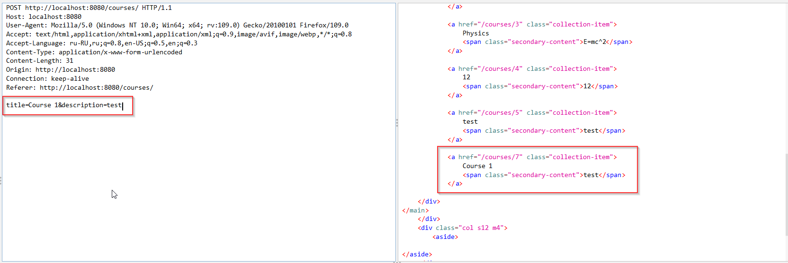

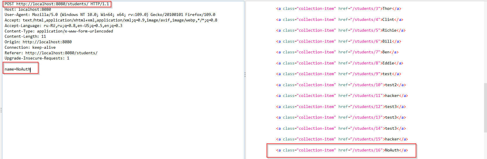

</details></blockquote>
</details>

-------

<details>
<summary>Наличие `SQL Injection` уязвимости на странице</summary><blockquote>

**Сервис**: `sqli`  
**Описание**: 
- Через форму создания студента есть возможность передать sql код  
**Критичность:** <font color="red">**Высокая**</font>
Существует возможность выполнения следующих действий:  
- Добавление, изменение данных в таблицах 
- Удаление данных из таблиц (Нарушение дос)
- Нарушение схемы БД 

**Предложения по исправлению**:  
- Добавить валидацию, санитизацию входных данных с формы 

<details>
<summary> Подробности реализации</summary>

1. Перейти на страницу `/students` и форме создания студента использовать следующий вектор атаки:  
```
user');drop table users; --
```
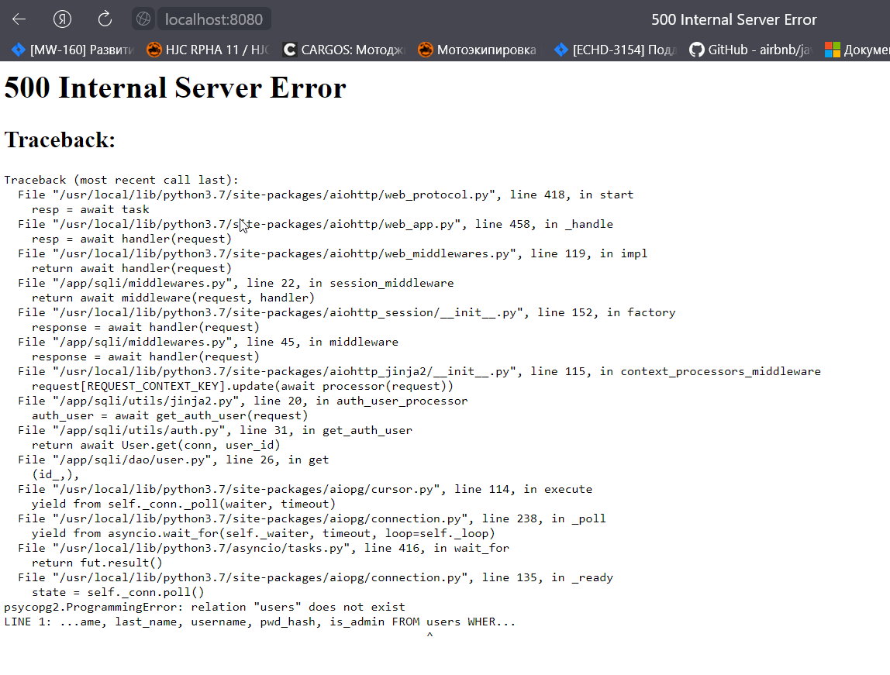

2. Запрос выполнился корректно.  
Таблица `users` удалена.  

Проблема находится в данном участке кода
```
@staticmethod
    async def create(conn: Connection, name: str):
        q = ("INSERT INTO students (name) "
             "VALUES ('%(name)s')" % {'name': name})
        async with conn.cursor() as cur:
            await cur.execute(q)
```

</details></blockquote>
</details>

-------

<details>
<summary>Использование стандартных УЗ</summary><blockquote>

**Сервис**: `postgres`  
**Описание**: 
- При настройке базового образа сервиса используется стандартная УЗ `postgres` как при работе в контейнере, так и для работы в БД
- Подключение к БД возможно без ввода пароля.  

**Критичность:** <font color="red">**Высокая**</font>  
Существует возможность выполнения следующих действий:  
- Получение паролей пользователей БД
- Получение паролей пользователей приложения
- Нарушение целостности данных БД  

**Предложения по исправлению**:  
- Сделать корректную настройку конфигурации Postgresql 
`/var/lib/postgresql/data/pg_hba.conf`

<details>
<summary> Подробности реализации</summary>

1. Подключение к контейнеру, запрос конфигурации PostgreSql
```
sudo docker exec -it -u root 9a86489cf6b9 /bin/bash
cat /var/lib/postgresql/data/pg_hba.conf
```

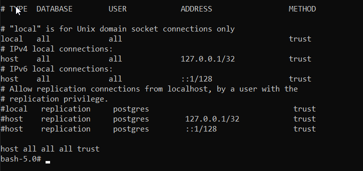

2. Подключение к БД, запрос пользователей
```
sudo psql -h localhost -U postgres -d sqli localhost
psql: warning: extra command-line argument "localhost" ignored
psql (14.5 (Ubuntu 14.5-0ubuntu0.22.04.1), server 9.6.15)
Type "help" for help.

sqli=# select * from pg_authid;
```
3. Подключение к БД, запрос пользователей приложения

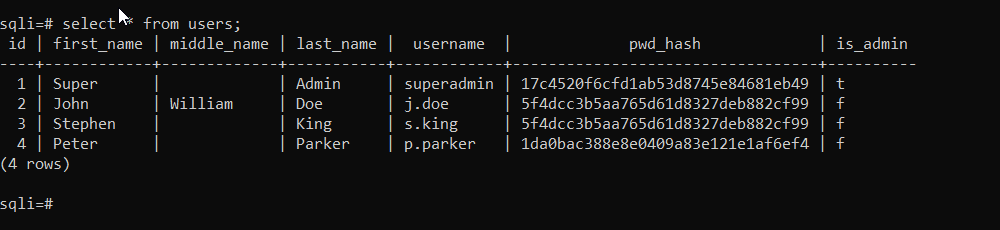

</details></blockquote>
</details>

-----

<details>
<summary>Использование чужой сессии</summary><blockquote>

**Описание**:   
Есть возможность скопировать сессионную куку пользователя из одного браузера в другой и продолжить работать в обоих браузерах.   
**Критичность:** <font color="orange">**Средняя**</font>  
Существует возможность выполнения следующих действий:  
- Кражи пользовательской куки
- Реализация XSS атаки  

**Предложения по исправлению**:  
 - Сделать привязку сессионной куки пользователя к устройству(браузеру)
 - Установить время жизни сессии пользователя в период бездействия

<details>
<summary>Подробности реализации</summary>

- Заходим пользователем `superadmin` на страницу `/courses/2` с существующей хранимой XSS. Получаем сообщение с текущими значениями куки пользователя  
- Копируем сессионную куку `AIOHTTP_SESSION` в другой браузер и обновляем страницу. После обновления приложение не будет требовать авторизации и будет отображено имя пользователя `Super Admin`

</details></blockquote>
</details>

-----

<details>
<summary>Слабые алгоритмы хеширования и простые пароли</summary><blockquote>

**Описание**: При хешировании паролей пользователей БД и приложения используется алгоритм `MD5`. Этот алгоритм не рекомендован к использованию по причине его низкой криптостойкости.  
**Критичность:** <font color="orange">**Средняя**</font>  
Существует возможность выполнения следующих действий:  
- Подбор пароля по радужным таблицам
- Подбор пароля используя уязвимости алгоритма 

**Предложения по исправлению**:  
 - Использовать более криптостойкий алгоритм хеширования (например `SHA 256/512`) или алгоритмы хеширования с большим потреблением оперативной памяти (например `Argon2`), для защиты от перебора паролей из украденной БД
 - Использовать соль при генерации хеша пароля
 - Настроить PostgreSql на использование более криптостойкого алгоритма `scram-sha-256`.

<details>
<summary>Подробности реализации</summary>

Используем хеши паролей найденные на предыдущих этапах тестирования.  
Подбор пароля будет производить с помощью сервиса [crackstation](https://crackstation.net/)  

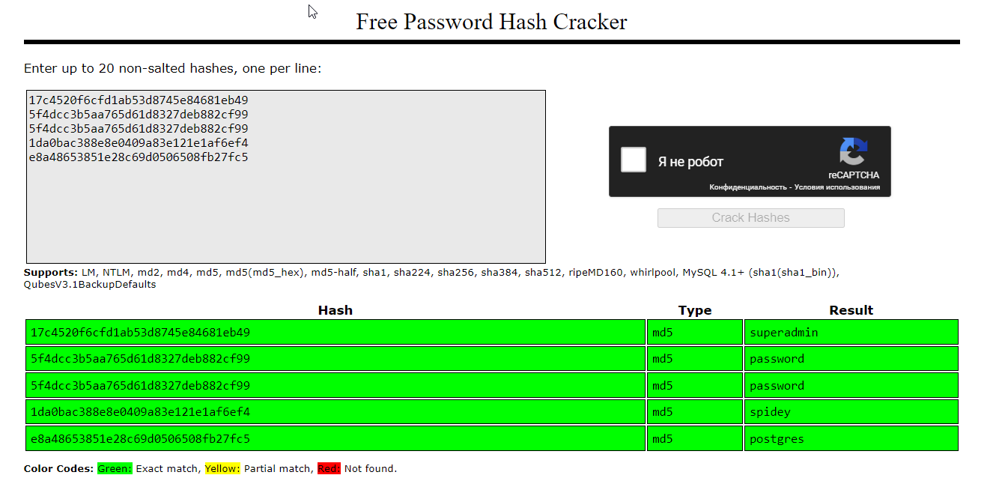

Используем один из найденных паролей для авторизации в приложении. Например `j.doe`/`password`

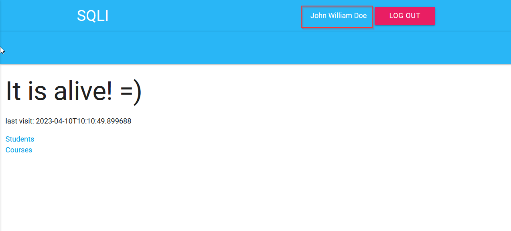

</details></blockquote>
</details>

-----

<details>
<summary>Хранимая XSS</summary><blockquote>

**Страница**: `/courses/1/review`  
**Описание**: есть возможность провести ревью решения задачи и оставить свой комментарий. При этом на форме отсутствует валидация ввода пользователя и есть возможность ввести кусок html-разметки, которая сохраняется и отображается на странице `/courses/1` всем пользователям.  
**Критичность:** <font color="orange">**Средняя**</font>  
Существует возможность выполнения следующих действий:  
- Кража сессионной куки
- Перенаправление пользователей на сторонние сайты
- Выполнение XSRF атак на другие сайты в этой страницы  

**Предложения по исправлению**:  
- Добавить валидацию/санитизацию пользовательского ввода  
- Установить у сессионной куки флаг `HttpOnly:true`. Это позволит блокировать обращение к сессионной куке из JS кода.  

<details>
<summary>Подробности реализации</summary>

1. Заходим на страницу `/courses/1` и нажимаем кнопку `Review course`  
2. На странице `/courses/1/review` в поле ввода `Write review to Math` добавляем XSS Locator для быстрого определения наличия XSS уязвимости.  
```
javascript:/*--></title></style></textarea></script></xmp><svg/onload='+/"/+/onmouseover=1/+/[*/[]/+alert(1)//'>
```
3. Сохраняем данные. И после открытия страницы `/courses/1` получаем всплывающее сообщение `1`. Это означает, что наш XSS Locator выполнился.
4. Добавим полезную нагрузку.
```
Решение верное! 
```
5. Добавляем куки в другой браузер `AIOHTTP_SESSION=56ba17aba0514edda5d81a2dda97786b` и видим, что мы работаем под пользователем `Super Admin`  
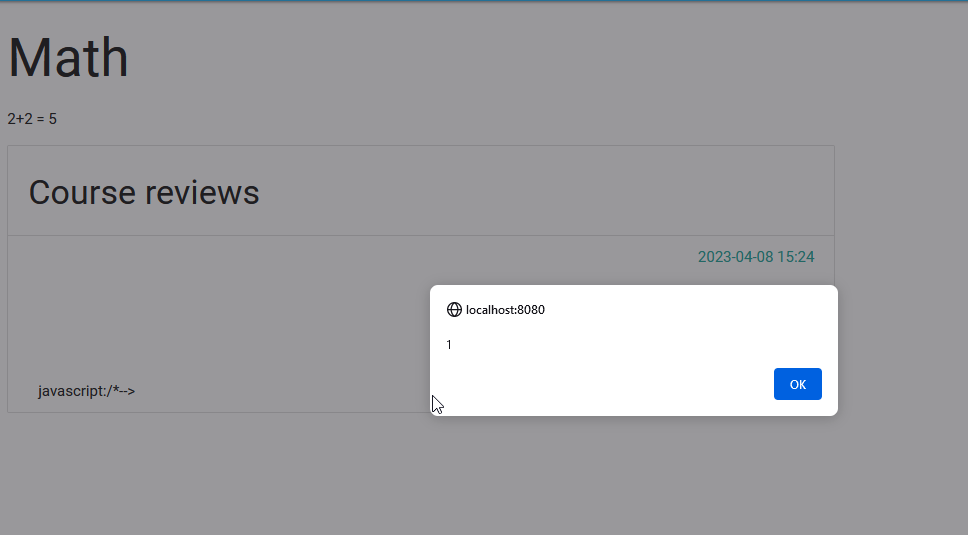  

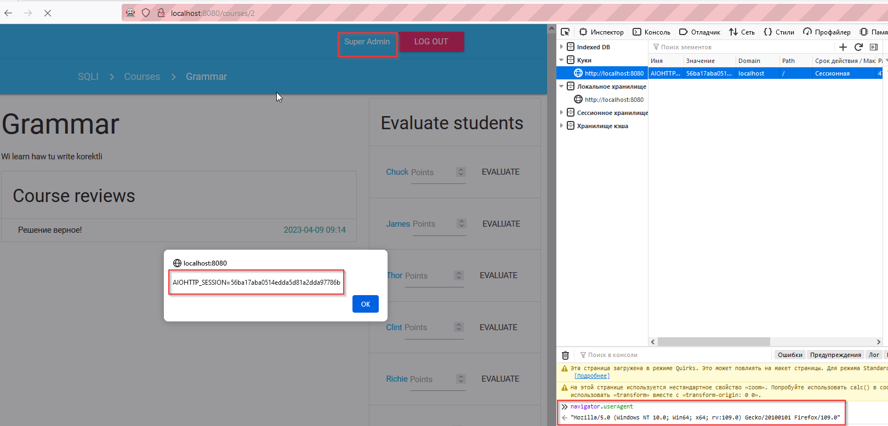

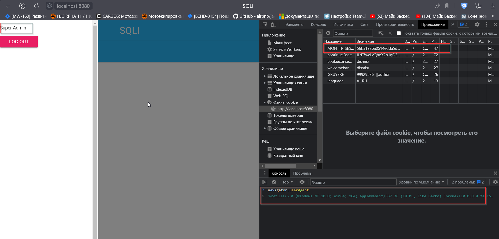

</details></blockquote>
</details>

-----

<details>
<summary>Перебор паролей</summary><blockquote>

**Описание**: При авторизации в приложении нет ограничений на количество попыток ввода паролей пользователей, что открывает возможность к перебору пароля от известного пользователя или подбору комбинации логина и пароля.   
**Критичность:** <font color="orange">**Средняя**</font>  
Существует возможность выполнения следующих действий:  
- Подбор пароля методом "грубой силы"

**Предложения по исправлению**:  
 - Установить ограничение попыток ввода пароля
 - Установить ограничение попыток авторизации по IP-адресу

<details>
<summary>Подробности реализации</summary>

Для упрощения задачи используем заданее известный логин пользователя `p.parker`. 

```
sudo hydra -l p.parker -s 8080 -P SecLists-master/Passwords/Common-Credentials/10-million-password-list-top-10000.txt localhost http-post-form "/:_csrf_token=b5ffacc75ef7404690379ce436772c8b&username=p.parker&password=^PASS^:Invalid username or password" -f -v
```

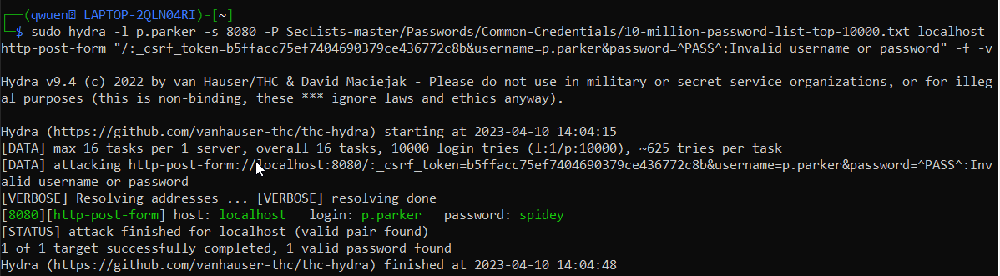

</details></blockquote>
</details>

-----

<details>
<summary>Реализация атаки XSRF, Сlickjacking</summary><blockquote>

**Описание**:   
Уязвимость позволяет заставить пользователя, который находится на одном сайте выполнять действия на другом сайте. Это работает за счет отправки от имени пользователя запросов на другой сайт, где у пользователя есть активная сессия. Целевой сайт будет получать сессионные куки пользователя, проводить идентификацию и выполнять запрос от имени пользователя. В случае атаки `Сlickjacking` сущетвует возможность открыть целевой сайт в `iframe` и отобразить поверх своего сайта с прозрачным фоном. Пользователь будет работать с одним сайтом и тем временем наживать реальные кнопки в `iframe` и выполнять действия на другом сайте.  
**Критичность:** <font color="orange">**Средняя**</font>  
Существует возможность выполнения следующих действий:  
- Загрузка сайта в iframe 
- Отправка запросов на другой сайт вместе с сессионными куками  

**Предложения по исправлению**:  
 - Установить флаг сессионной куки `SameSite:"Strict"`
 - Установить заголовок `X-Frame-Options: SAMEORIGIN` или `DENY`  
 `DENY`- Никогда не показывать страницу внутри фрейма.  
 `SAMEORIGIN` - Разрешить открытие страницы внутри фрейма только в том случае, если родительский документ имеет тот же источник.
- Включить проверку csrf токена. Сейчас токен на странице есть, но сайт не проверяет наличие этого токена в запросах  
`_csrf_token=024d9f2d986b418ebc7423f01a6f3fcb`
<details>
<summary>Подробности реализации</summary>

- Создаем страницу с подготовленной формой и `iframe` с целевым сайтом  

```
<form action="http://localhost:8080/students/" method="post">
    <input type="hidden" name="name" value="hacker" />
    <input type="submit" value="Update page" />
</form>
<iframe width="1000px" height="1000px" src="http://localhost:8080/"></iframe>
```
- Пользователь нажимает кнопку обновить страницу и тем временем выполняет запрос на создание нового студента.

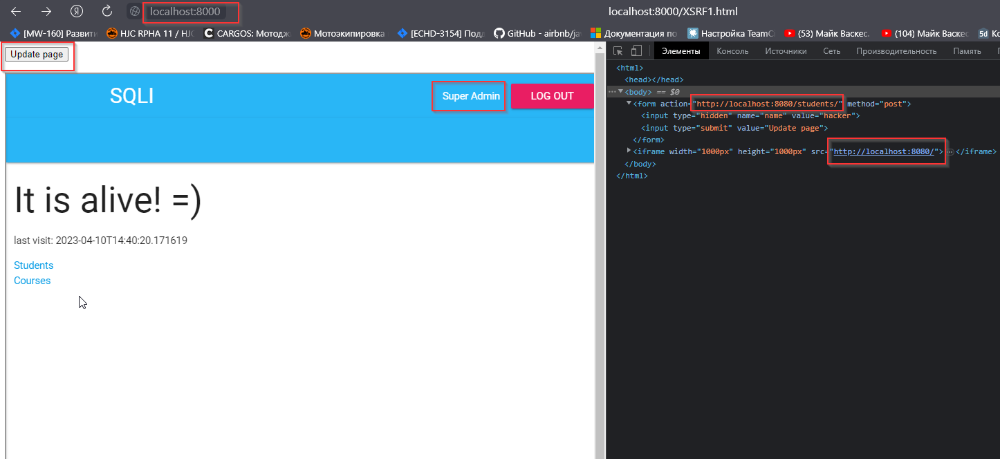  

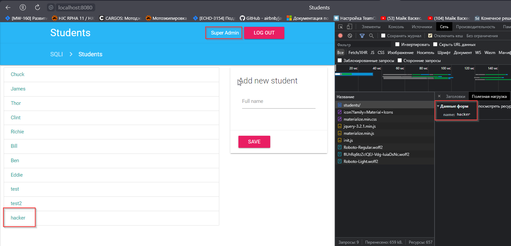

</details></blockquote>
</details>

-----

## Используемые инструменты
- OWASP ZAP
- Hydra
- Sqlmap
- NMap
- Psql
- Docker
- Python 3 (http-server)
- [crackstation.net](https://crackstation.net/)
- Kali linux
- [Dirsearch](https://www.kali.org/tools/dirsearch/)
- Visual Studio Code
- Mozilla Firefox
- Yandex Browser

## Источники информации
- [OWASP Top 10 - 2021](https://owasp.org/Top10/)
- [Docker hub](https://hub.docker.com/)
- [OWASP WSTG](https://owasp.org/www-project-web-security-testing-guide/)
- [XSS Polyglot](https://github.com/0xsobky/HackVault/wiki/Unleashing-an-Ultimate-XSS-Polyglot)  
- [Exploit-db](https://www.exploit-db.com/)